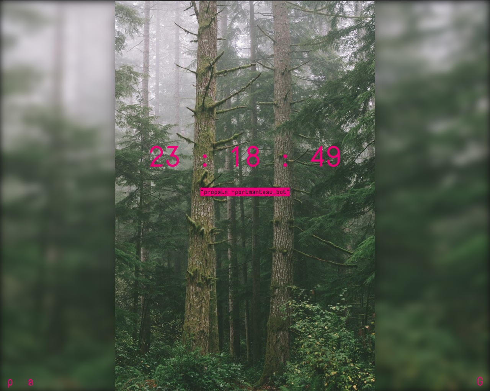

# a e s t h e t i c new tab
------------------------------------
Takes an image and a quote from two twitter accounts and displays them.

It uses codebird.js to access tweets.

## How to use
1. [Create twitter account](https://twitter.com/)
2. [Create 2 Twitter apps](https://apps.twitter.com/)
3. Place the 8 keys and tokens into lib/tweets.js
4. Done!
